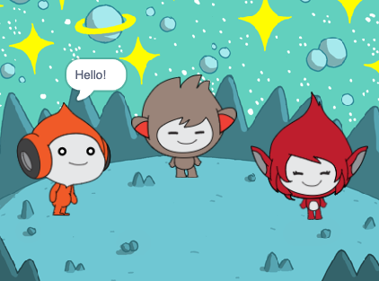

## What you will make

Create a space scene!

--- no-print ---
--- task ---
### Play ▶️

  
Click on each sprite to see what they do. 

  <iframe allowtransparency="true" width="485" height="402" src="https://scratch.mit.edu/projects/embed/485673032/?autostart=false" frameborder="0"></iframe>

--- /task ---

Follow along the project on our [YouTube](https://projects.raspberrypi.org/en/projects/space-talk-visual/7) playlist!

Print our NEW [visual-first]([7](https://projects-static.raspberrypi.org/projects/space-talk-visual/e9e1191ee52fc883c40c3211aae149917bf23c1b/en/resources/space-talk-visual.pdf)) step-by-step guide!

--- /no-print ---

--- print-only ---

--- /print-only ---

