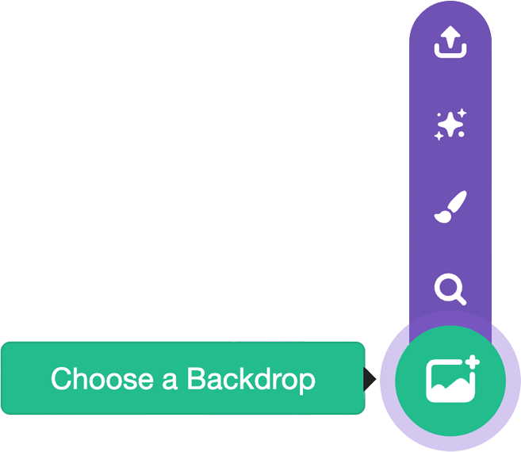
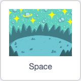
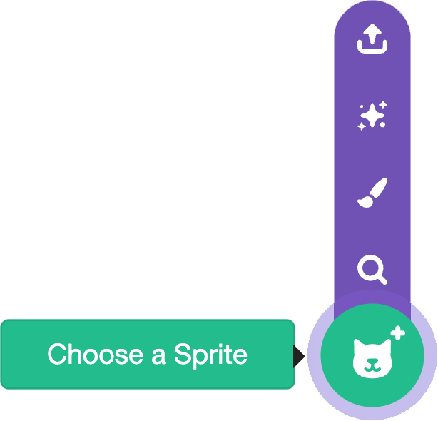

## Create your scene

Add a space backdrop and the first sprite.

{:width="300px"}

--- no-print ---

<iframe
    src="https://www.youtube.com/embed/GaoChS1fG3o?rel=0&cc_load_policy=1"
    style="position: absolute; inset: 0; width: 100%; height: 100%; border: none;"
    allowfullscreen>
</iframe>

 
Play, pause, make. Follow the project on our [YouTube](7) playlist!

--- /no-print ---

### Delete the cat sprite

--- task ---
Select the **Sprite1** sprite and click the **Delete** icon.

--- /task ---

### Add a backdrop

--- task ---

Open a [new project](https://scratch.mit.edu/projects/582213331/editor){:target="_blank"}.

[[[working-offline]]]

--- /task ---

--- task ---

Choose a Backdrop.

{:width="300px"}

--- /task ---

--- task ---

Click the **Space** category.

--- /task ---

--- task ---

Click the 'Space' backdrop.

--- /task ---

--- task ---

Choose a Sprite.

{:width="300px"}

--- /task ---

--- task ---

Select the **Fantasy** category and then the **Pico** sprite.

--- /task ---

--- task ---

Move **Pico** to the left. 

Your Stage should look like this:

--- /task ---

### Save

--- task ---

If you are signed in to your Scratch account, click on the green Remix button.

--- /task ---

--- task ---

Name your project.

**Tip:** Use helpful names so you can find them easily. 

--- /task ---

--- task ---

Click **File**, then **Save now**.

If you are not online or you do not have a Scratch account, click on **Save to your computer**.

--- /task ---
