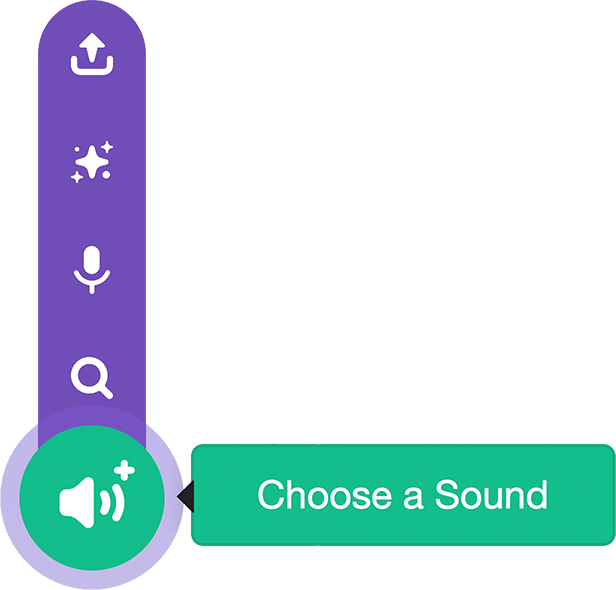

## Pico plays a sound

<div style="display: flex; flex-wrap: wrap">
<div style="flex-basis: 200px; flex-grow: 1; margin-right: 15px;">
  
Make Pico emote with sound.
</div>
</div>

--- no-print ---

<div style="position: relative; width: 100%; aspect-ratio: 16 / 9; border-radius: 20px; box-shadow: 0 0 15px #3fb654; overflow: hidden;">
<iframe
    src="https://www.youtube.com/embed/TJpuF9hKigg?rel=0&cc_load_policy=1"
    style="position: absolute; inset: 0; width: 100%; height: 100%; border: none;"
    allowfullscreen>
</iframe>
</div>

<div style="text-align: center; margin-top: 1em;">

Play, pause, make. Follow the project on our [YouTube](7) playlist!
</div>
--- /no-print ---

### Add a sound to the Pico Sprite

--- task ---

Click the **Sounds** tab.


--- /task ---

--- task ---

Choose a Sound.

{:width="300px"}

--- /task ---

--- task ---

Click the **Space** category.


--- /task ---

--- task ---

 Choose a sound. We chose 'Alien Creak1'.

 

--- /task ---

### Make the sound play when clicked (or tapped)

--- task ---

Click the **Code** tab. 


--- /task ---

--- task ---

Open the the `Sound`{:class="block3sound"} blocks menu and drag a `start sound`{:class="block3sound"} block between the `when this sprite clicked`{:class="block3events"} block and the `say`{:class="block3looks"} block.

```blocks3
when this sprite clicked
+start sound [Alien Creak1 v] 
say [Hello!] for [2] seconds
```

--- /task ---

--- task ---

**Test:** Click **Pico** and check you can hear the sound.

--- /task ---