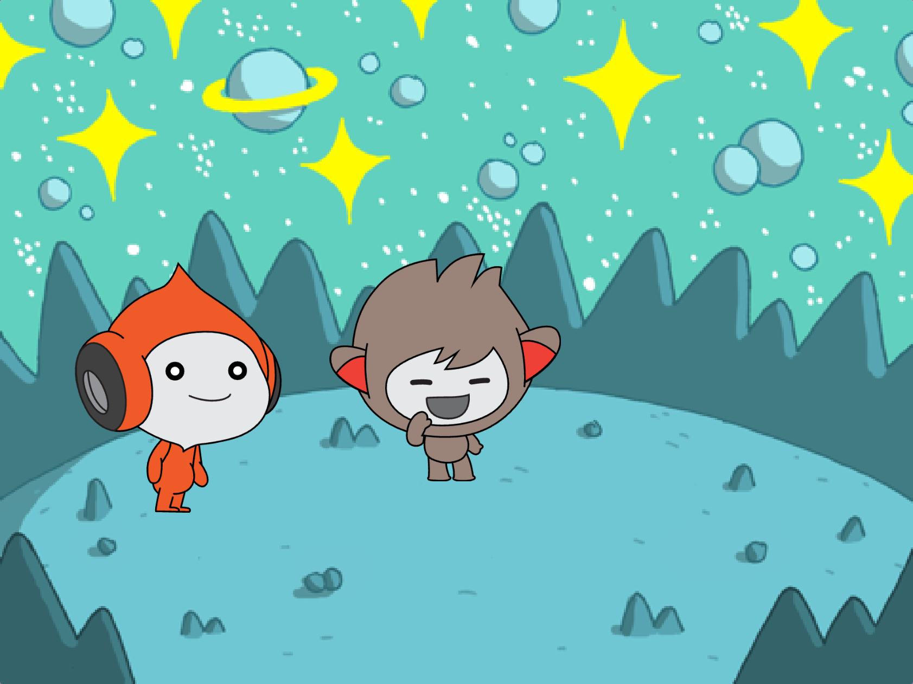
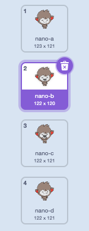
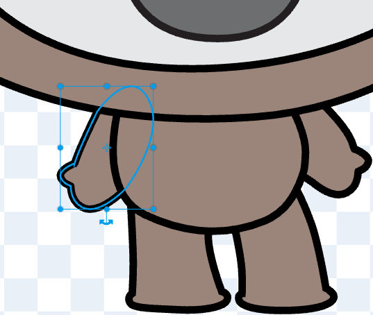
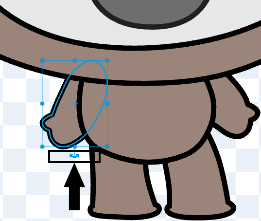
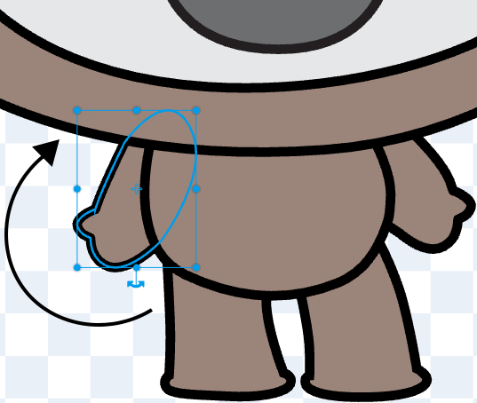
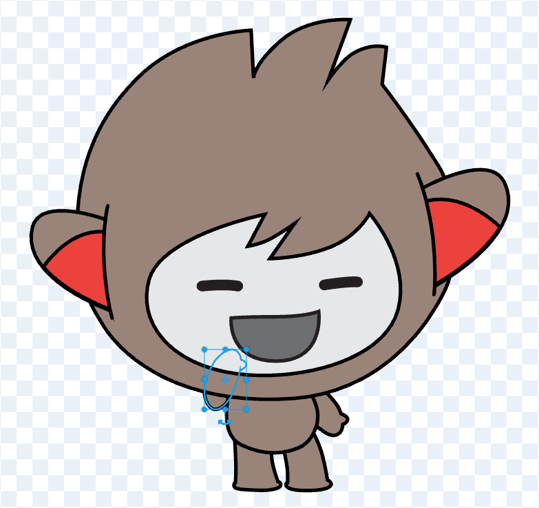

## Nano signs "Thanks!"

  
Get Nano to sign by editing a costume.

{:width="300px"}

--- no-print ---

<iframe
    src="https://www.youtube.com/embed/C9NDgKaZHDE?rel=0&cc_load_policy=1"
    style="position: absolute; inset: 0; width: 100%; height: 100%; border: none;"
    allowfullscreen>
</iframe>

Play, pause, make. Follow the project on our [YouTube](7) playlist!

--- /no-print ---

### Nano uses sign language

--- task ---

Click the **Costumes** tab. 

--- /task ---

--- task ---

Click the **nano-b** costume. 

--- /task ---

--- task ---

Click the arm on the left-hand side.

{:width="300px"}

--- /task ---

--- task ---

Use the double-headed 'rotate' arrow and drag the mouse up to rotate the arm.

{:width="300px"}

{:width="300px"}

The costume should look like this:

{:width="300px"}

--- /task ---

--- task ---

Click the 'Front' tool.

{:width="100px"}

The costume should look like this:

{:width="300px"}

--- /task ---

**Tip:** If you make a mistake, you can click on **Undo**.

--- no-print ---

--- /no-print ---

--- task ---

**Test:** Click **Nano** and check the costume changes to the new version.

--- /task ---

You have learned how to sign "thank you". Next time you thank someone, why not use your new skill?

